<div align="center">

# 🧬 CausalOps

### Causal inference, not correlation, on top of OpenMetadata.

[](https://opensource.org/licenses/Apache-2.0)
[](https://www.typescriptlang.org/)
[](https://www.python.org/)
[](https://nextjs.org/)
[](https://trpc.io/)
[](https://www.pywhy.org/dowhy/)
[](https://open-metadata.org/)
[]()

**[Live demo](#-the-product) · [Architecture](#-architecture) · [Back-test results](#-back-test-results) · [Quickstart](#-quickstart) · [MCP integration](#-mcp-integration)**

</div>

---

## 🎯 The problem

> *It's 3 a.m. Your pipeline broke. OpenMetadata shows you fifteen things that changed upstream that day. Which one is the cause? Which fourteen are coincidences?*

OpenMetadata gives you **lineage + a list of events**. It cannot answer *why*. So oncalls fall back to **"the most recent upstream change wins"** — a heuristic that gets the wrong answer **half the time**, because confounded coincidences fire on every alert. That's how teams burn 4 hours chasing the wrong wire.

## ✨ The solution

CausalOps adds a **causal-inference layer** on top of OpenMetadata. It treats lineage as a **causal graph**, fits a **structural causal model** over your change events and DQ test results, and answers two questions the catalog cannot:

| Question | Flow | Algorithm |
|---|---|---|
| **Why did this fail?** | Counterfactual RCA | Backdoor adjustment + propensity-score matching |
| **What breaks if I deploy this?** | Intervention simulation | Monte-Carlo forward propagation |

Every answer ships with **placebo p-values, subset stability, and 95% confidence intervals** — so you can tell a confident model from a correct one.

> 🏆 **Validated:** 80% top-1 accuracy vs 50% recency baseline on 20 ground-truth incidents.

---

## 📸 The product

### Home — failures + risk at a glance


> Dark-mode dashboard with a gradient-mesh background. The hero card frames the value prop. Four stat cards expose key health metrics. Recent failures stream in on the left; entities ranked by risk on the right. Hit *Investigate a failure* to drop into RCA, or *Simulate a change* to forecast blast radius.

---

### Graph — lineage as a causal DAG


> Force-directed DAG with risk-coloured nodes. The cyan-ringed `revenue_view` is the entity in focus. `campaign_attribution` glows red (risk 0.71), `Marketing-Attribution` glows amber (risk 0.62). Filter by entity type, scrub the time window, click any node for owner / risk score / action buttons.

---

### What-if — interventional blast radius


> Pre-fill target entity, action (`drop_column`), and column. Slide Monte-Carlo samples up to 5000. The simulator runs forward propagation through the causal subgraph and returns per-asset breakage probabilities. The path column shows *why* — `discount_code referenced in join`, etc.

---

### Why — counterfactual RCA *(coming soon — see [demo video](#-demo-video))*

> Three-column layout: 14-day upstream events on the left, upstream-only DAG in the middle with the failed outcome ringed cyan, ranked candidate causes on the right. Click any cause to expand the EvidencePanel — effect size, P(factual), P(counterfactual), 95% CI, placebo p-value, subset stability, and the method used.

---

## 🎬 Demo video

Watch the 3-minute walkthrough: **[YouTube](#)** *(replace with your link)*

A click-by-click walkthrough is in the video.

---

## 📊 Back-test results

> The model is only as good as its validation. We injected **20 ground-truth incidents** — 10 true causal pairs and 10 confounded coincidences — and replayed them through both CausalOps and a naive recency baseline.

| Metric | CausalOps | Baseline (most-recent-wins) |
|---|---|---|
| **Top-1 accuracy** *(true causes)* | **80%** | 50% |
| Top-3 hit rate *(true causes)* | **100%** | — |
| Mean reciprocal rank | **0.900** | — |
| False-positive rate *(confounded picked)* | 30% | 100% |
| **Overall correctness** | **75%** | 50% |

Reproduce the back-test:

```bash
pnpm incidents:inject --seed 42
pnpm backtest
```

---

## 🏗️ Architecture



```
OpenMetadata ──▶ Ingestor ──▶ TimescaleDB ──▶ Causal worker (Python)
                                  │                  │
                                  ▼                  │
                                  API ◀──────────────┘
                                  │
                            ┌─────┴─────┐
                            ▼           ▼
                          Web UI       MCP server
                                          │
                                          ▼
                              OM chat / Claude Desktop
```

| Layer | Service | Tech |
|---|---|---|
| **Source of truth** | OpenMetadata | OM 1.5.13 — lineage, events, DQ, tags |
| **Stream ingest** | `packages/ingestor` | BullMQ + Drizzle + postgres-js |
| **Storage** | TimescaleDB | 1-day hypertable chunks for events + results |
| **Causal engine** | `services/causal-worker` | FastAPI · DoWhy · EconML · NetworkX |
| **API** | `apps/api` | Fastify 5 + tRPC 11 + Zod |
| **Web** | `apps/web` | Next.js 15 + React 19 + D3 + Tailwind |
| **MCP** | `apps/mcp` | @modelcontextprotocol/sdk · stdio + SSE |

---

## 🔌 OpenMetadata integration

Every interaction with OM is intentional and traceable.

| Endpoint | Purpose | Code path |
|---|---|---|
| `GET /lineage/table/name/{fqn}` | Build the causal DAG | [`pollLineage.ts`](packages/ingestor/src/jobs/pollLineage.ts) |
| `GET /events` | Collect treatments (schema/owner/tag/desc changes) | [`pollEvents.ts`](packages/ingestor/src/jobs/pollEvents.ts) |
| `GET /dataQuality/testCases/testCaseResults` | Collect outcomes (DQ failures) | [`pollTestResults.ts`](packages/ingestor/src/jobs/pollTestResults.ts) |
| `PUT /lineage` | Seed column-level lineage in demos | [`seed-om.ts`](scripts/seed-om.ts) |
| `PATCH /tables/name/{fqn}` *(JSON Patch)* | Write **risk score + top cause** back to entity `extension` | [`omWriteBack.ts`](apps/api/src/services/omWriteBack.ts) |
| `POST /webhook/om` *(receiver)* | Live-ingest OM ChangeEvents | [`omEvents.ts`](apps/api/src/webhooks/omEvents.ts) |
| `POST /events/subscriptions` | Register CausalOps as an OM subscription target | [`webhook.ts`](packages/om-client/src/webhook.ts) |

---

## 🚀 Quickstart

```bash
# 1. Setup
git clone https://github.com/Sushant6095/Casusal-ops-metadata.git CausalOps
cd CausalOps
cp .env.example .env                                 # paste your OM_JWT_TOKEN

# 2. Infra — Postgres + Timescale + Redis + OM
docker compose up -d                                 # ~3 min for OM cold start

# 3. Install + build
pnpm install
pnpm --filter @causalops/om-client build
pnpm --filter @causalops/ingestor build
pnpm --filter @causalops/api build

# 4. Migrate + seed
pnpm --filter @causalops/ingestor db:migrate
pnpm demo:seed                                       # 9 entities, 29 events, 63 results

# 5. Run all services (3 terminals)
node apps/api/dist/server.js                         # :3001
pnpm --filter @causalops/web dev                     # :3000
services/causal-worker/.venv/bin/python -m uvicorn src.main:app --port 8000
```

Open <http://localhost:3000>.

> 🩺 **Health check:** `curl localhost:3001/health localhost:8000/health localhost:3000` — should all return 200.

No-OM-token demo: skip step 4's `seed:om` and use `pnpm demo:seed` — populates TimescaleDB directly.

---

## 🎩 MCP integration

CausalOps exposes 4 tools over the Model Context Protocol — callable from OpenMetadata's chat panel **or** any MCP client.

| Tool | What it does |
|---|---|
| `rank_causes` | Counterfactual RCA on a failed outcome |
| `simulate_intervention` | Blast-radius forecast for a proposed change |
| `get_risk_score` | Read CausalOps risk score from OM extension |
| `list_failures` | Recent DQ failures within a window |

### Claude Desktop config

```json
{
  "mcpServers": {
    "causalops": {
      "command": "node",
      "args": ["<repo>/apps/mcp/dist/server.js"],
      "env": { "API_BASE_URL": "http://localhost:3001" }
    }
  }
}
```

### OpenMetadata MCP host config

See [`apps/mcp/mcp.config.json`](apps/mcp/mcp.config.json) — paste into OM Settings → Integrations → MCP Servers.

---

## 🧠 Theory — what makes this different

1. **Correlation ≠ causation in lineage.** Two tests failing at the same time are usually downstream of a *shared* cause, not of each other. Recency-based attribution gets this wrong by construction.
2. **Do-calculus is the right algebra.** `P(Y | do(X))` is a different quantity than `P(Y | X)`. CausalOps computes the former by **backdoor adjustment** over OM's lineage DAG.
3. **Backdoor + propensity score matching.** We pick the minimal adjustment set (parents of the treatment, minus descendants), then match propensity scores between treated and untreated time-buckets. EconML's Double-ML kicks in when the adjustment set grows past 20 covariates.
4. **Refutation is non-negotiable.** Placebo permutation p-value + subset stability ship on every estimate. *Confidence in the UI* is a weighted function of both, not a tone-of-voice decision.


---

## 🛠️ Tech stack

<details>
<summary><b>TypeScript monorepo</b> (pnpm + turborepo)</summary>

- **Web**: Next.js 15 · React 19 RC · Tailwind CSS · D3 force · Lucide · Framer Motion
- **API**: Fastify 5 · tRPC 11 · Zod · Pino · Prom-client
- **Ingest**: BullMQ · Drizzle ORM · postgres-js
- **Shared**: `@causalops/om-client` (Axios + Zod) · `@causalops/ingestor` (drizzle schema)
- **MCP**: @modelcontextprotocol/sdk · undici · superjson

</details>

<details>
<summary><b>Python service</b> (only one in the repo)</summary>

- **Web**: FastAPI · uvicorn · pydantic v2
- **DB**: asyncpg
- **Causal**: DoWhy · EconML · scikit-learn · causal-learn · NetworkX

</details>

<details>
<summary><b>Data plane</b></summary>

- **OpenMetadata** 1.5.13 (official Docker images: server, MySQL, OpenSearch, ingestion)
- **TimescaleDB** (pg16) — 1-day hypertable chunks for `change_events` + `test_case_results`
- **Postgres 16** for app state
- **Redis 7** for BullMQ

</details>

---

## 📂 Repository structure

```
CausalOps-hackathon/
├── apps/
│   ├── api/                 # Fastify + tRPC backend
│   ├── web/                 # Next.js 15 dashboard
│   └── mcp/                 # Model Context Protocol server
├── packages/
│   ├── om-client/           # Typed OpenMetadata REST wrapper (zod + axios)
│   └── ingestor/            # BullMQ workers + Drizzle schema
├── services/
│   └── causal-worker/       # FastAPI + DoWhy + EconML
├── scripts/
│   ├── seed-om.ts           # Seed OM with demo entities + lineage
│   ├── inject-incidents.ts  # 20 ground-truth (treatment, outcome) pairs
│   ├── demo-seed-timescale.ts # No-OM-token demo seed
│   └── backtest.ts          # Validation harness
├── docs/
│   ├── architecture.svg     # System diagram
│   └── screenshots/         # Product screenshots
├── docker-compose.yml
└── README.md
```

---

## 🗺️ Roadmap

- [ ] Column-level DoWhy with SQL-transformation-aware propagation
- [ ] Time-varying confounders (Granger + synthetic control as additional baselines)
- [ ] Slack + PagerDuty narration channels — push the causal explanation to the on-call before they open a tab
- [ ] Live cache invalidation tied to OM webhooks
- [ ] Multi-tenant deployments + SSO

---

## 📝 License

[Apache 2.0](LICENSE) — use it, fork it, ship it.

## 🙏 Acknowledgements

- [**OpenMetadata**](https://open-metadata.org/) and **Collate** for the catalog and lineage substrate. *None of this works without the platform you've built.*
- [**DoWhy**](https://www.pywhy.org/dowhy/) and [**EconML**](https://econml.azurewebsites.net/) for the causal-inference plumbing.
- [**TimescaleDB**](https://www.timescale.com/) for making 30-day event windows cheap.
- The **Model Context Protocol** community for making tools-for-LLMs boring.

---

<div align="center">

**Built for the OpenMetadata × Collate hackathon.**

⭐ Star the repo if this is useful · [Open an issue](https://github.com/Sushant6095/Casusal-ops-metadata/issues) for questions

</div>
