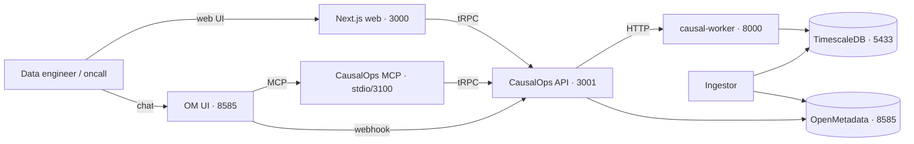
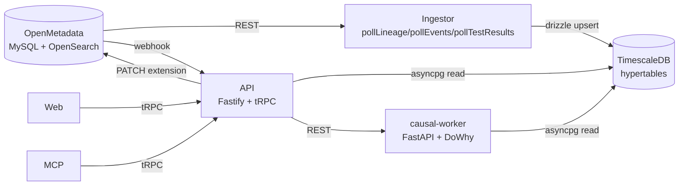
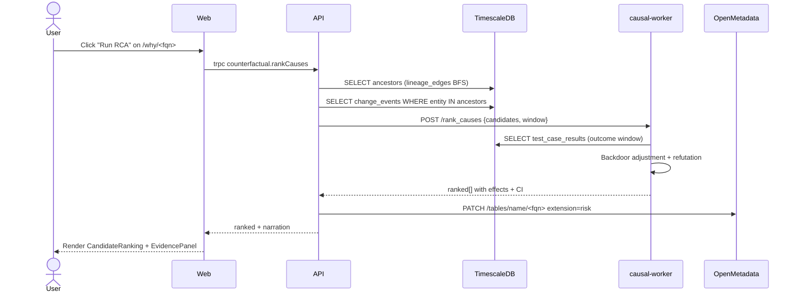
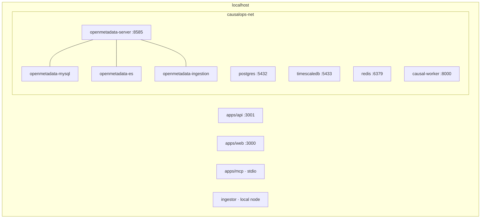

# Architecture

CausalOps layers causal inference on top of OpenMetadata without forking the
catalog. Every write is absorbed by the upstream platform (entity extensions,
change events, test results); every read happens against a read-optimized
projection in TimescaleDB. The Python worker is purely stateless math.

## 1 · System context

## 2 · Data flow

Hypertables: `change_events` and `test_case_results` are 1-day-chunked so
30-day lookbacks fan out across ~30 chunks and stay fast.

## 3 · Sequence: one `rank_causes` call

## 4 · Deployment (docker-compose)

All images pinned to OpenMetadata 1.5.13 + OpenSearch 2.11.1 + Postgres 16 +
TimescaleDB latest-pg16 + Redis 7-alpine. Volumes persist MySQL, OpenSearch,
Postgres, and TimescaleDB.
